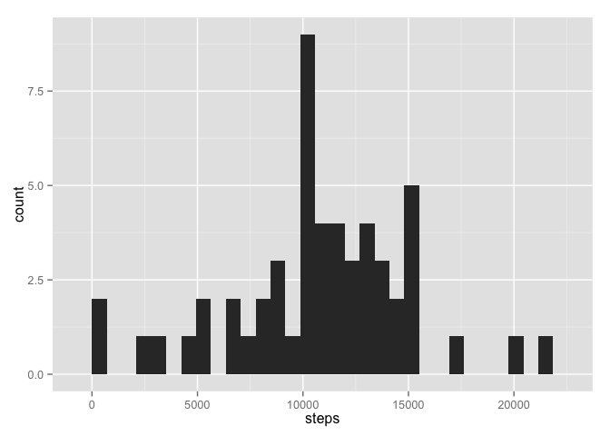
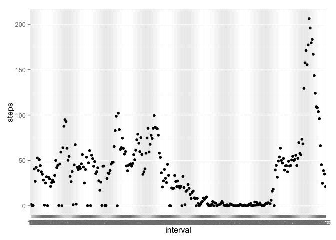
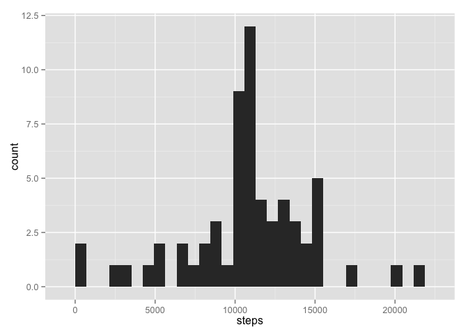

# Reproducible Research: Peer Assessment 1
## Loading and preprocessing the data


```r
unzip<-unzip("activity.zip",unzip="internal")
data<-read.csv(unzip, colClasses = c("integer", "Date", "factor"))
data$date<-format(data$date, "%Y-%m-%d", usetz = FALSE)
```

## What is mean total number of steps taken per day?

Here's a histogram, representing the total number of steps taken per day.

```r
ag<-aggregate(steps ~ date, data = data, sum)
library(ggplot2)
qplot(steps, data = ag)
```

```
## stat_bin: binwidth defaulted to range/30. Use 'binwidth = x' to adjust this.
```

 

```r
mean_steps<-mean(ag$steps)
median_steps<-median(ag$steps)
```

The mean of the total number of steps taken per day is 1.0766189\times 10^{4}. The median of the total number of steps taken per day is 10765.

## What is the average daily activity pattern?


```r
daily_pat<-aggregate(steps ~ interval, data = data, mean)
library(ggplot2)
g<-ggplot(daily_pat, aes(interval, steps))
g + geom_point(type = "l")
```

 

```r
max_steps<-max(daily_pat$steps)
max_r<-which(daily_pat$steps == max_steps)
max_int<-daily_pat[max_r,1]
```

The 835 5-min interval on average across all the days in the dataset contains the maximum number of steps!

## Imputing missing values


```r
z<-na.omit(data)
nNA<-nrow(data) - nrow(z)
sum(is.na(data$steps))
```

```
## [1] 2304
```

```r
sum(is.na(data$interval))
```

```
## [1] 0
```

```r
sum(is.na(data$date))
```

```
## [1] 0
```

The total number of observations with missing values in the dataset is 2304.
We can see that only steps column has NAs
I will substitute them with mean data for every interval.


```r
NAs<-which(is.na(data$steps) == TRUE)

data_new<-data

for (i in 1:2304) {
        n<-NAs[i]
        data_new[n, 1] <- daily_pat[which(daily_pat$int == data_new[n, 3]),2]
}

ag_new<-aggregate(steps ~ date, data = data_new, sum)
library(ggplot2)
qplot(steps, data = ag_new)
```

```
## stat_bin: binwidth defaulted to range/30. Use 'binwidth = x' to adjust this.
```

 

```r
mean_steps_n<-mean(ag_new$steps)
median_steps_n<-median(ag_new$steps)
```

The mean of the total number of steps taken per day is 1.0766189\times 10^{4}. The median of the total number of steps taken per day is 1.0766189\times 10^{4}. Imputing the NAs have caused the median steps data to become noninteger.


## Are there differences in activity patterns between weekdays and weekends?
